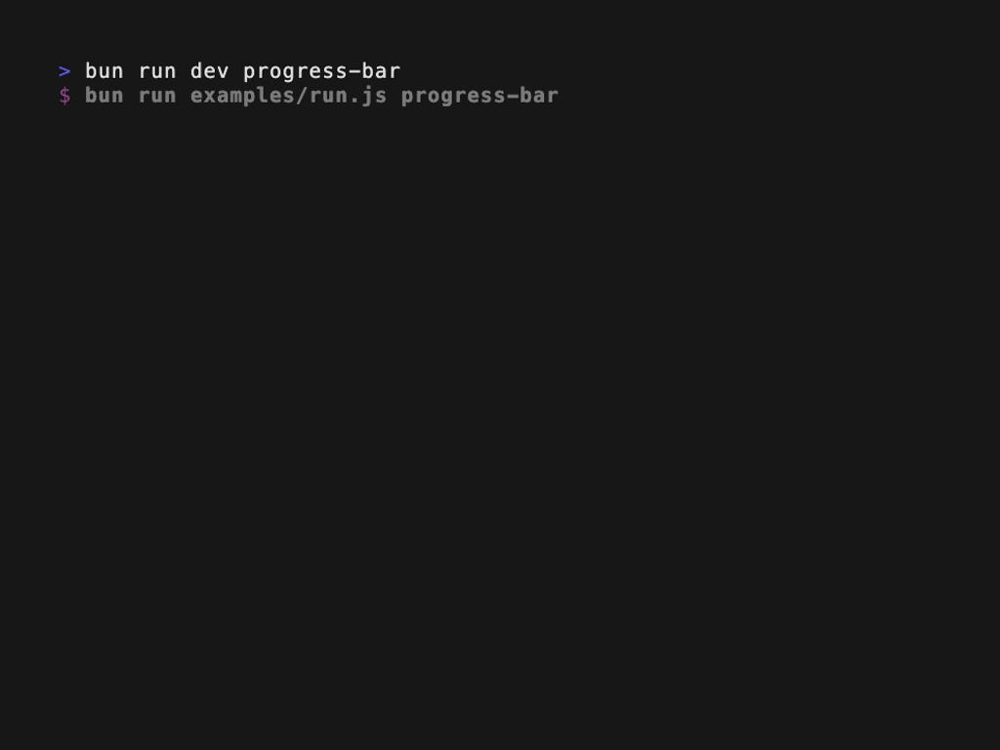

# Vuetty

A Vue.js custom renderer for building Terminal User Interfaces (TUIs). Vuetty brings Vue's reactive system and component model to the terminal, allowing you to build interactive command-line applications using familiar Vue.js syntax.

## Documentation

For detailed documentation, component references, and advanced usage, visit the [full documentation](https://tterrasson.github.io/vuetty/).

## Features

- **Vue-Powered Reactivity**: Leverage Vue's reactive system to build dynamic terminal applications. State changes automatically trigger UI updates.
- **Comprehensive Component Library**: Pre-built components for layout, text, input, and data visualization.
- **Flexbox-Inspired Layouts**: Create sophisticated terminal layouts using familiar flexbox concepts with Row, Col, and flex ratio components.
- **Single File Component Support**: Develop with standard Vue SFC syntax using templates, scripts, and styles.
- **Color Theming Support**: Built-in support for color themes to style your terminal applications.
- **Advanced Input Management**: Built-in keyboard and mouse input handling with focus management and interactive form components.
- **Optimized Performance**: Efficient rendering with smart caching for text, images, and markdown content.

## Demo



## Quick Start

Use the repository's `simple-app-example` to get a working app with routing and layout in place.

1) Clone and copy the example

```bash
git clone https://github.com/tterrasson/vuetty
cd vuetty
cp -a simple-app-example my-vuetty-app
cd my-vuetty-app
```

2) Install dependencies

```bash
bun install
```

3) Run the example

```bash
bun run dev
```

Press `Ctrl+C` to stop it.

## Running examples

From the repo root, list and run component examples:

```bash
bun run dev --list
bun run dev box
```

The available IDs are defined in `examples/examples.js`.

## Use Cases

Vuetty is designed for:

- CLI tools and interactive command-line applications
- Real-time monitoring dashboards for servers and services
- Development tools, debugging interfaces, and log viewers
- Data visualization with charts, graphs, and tables
- Form-based applications with validation

## License

MIT
